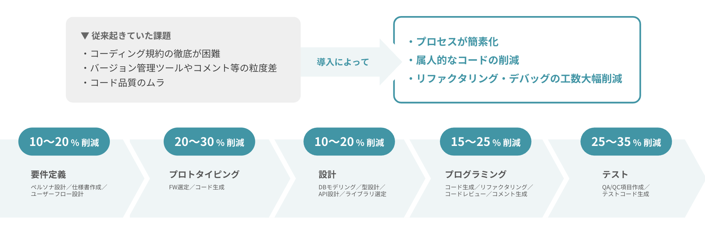

<!--
皆様、本日はお時間をいただき、ありがとうございます。
ATDDで加速させるAI駆動開発をはじめます。
-->

# ATDDで加速させるAI駆動開発

#### Yoshihisa Kaino (@yosh1)

2025-01-24 | AI駆動開発(AI-Driven Development) 勉強会（第5回）

---

<!--
エクステムの改野と申します。
現在AI駆動開発の研修を行うエクステム株式会社という会社をしております。
-->

## 自己紹介


### Yoshihisa Kaino (@yosh1)

- 2001年生まれ, 23歳
- エクステム株式会社 代表取締役
  - AI駆動開発 研修事業 🤖🔧
- GitHub: https://github.com/yosh1
- X: https://x.com/yoshi1125hisa


---

<!--
まず、ATDDは「Acceptance Test Driven Development」の略で、受け入れテスト駆動開発と呼ばれています。
特徴的なのは、要件をテストとして表現し、チーム全員が理解できる自然言語で記述することです。
-->

## ATDDってなに

### ATDD (Acceptance Test Driven Development) = 受け入れテスト駆動開発

- 要件をテストとして表現
- チーム全員が理解できる自然言語での記述
- テストを「後から書く」から「先に書く」へ

---

<!--
では、なぜ今ATDDなのか
それは、AI時代における開発の基盤と相性が良いためです。
AIツールは確かに便利ですが、正しい要件が必要です。
ATDDで要件をただしく整理し、AIツールを効果的に使うことができます。
-->

## Q. なぜいまATDDなのか？

### A. AI時代にマッチしているから
- AIツールは便利だが、正しい要件がないと意味がない
- コードの生成より、要件の明確化が先
- チーム全員が同じ言語で話せる

---

<!--
とくに、「AIが何を作ればいいのかわからない」「生成されたコードが要件を満たしているか不安」「AIの出力が安定しない」といった課題を解決できます
-->

## こんな課題を解決 ✓
- 「AIが何を作ればいいのかわからない」
- 「生成されたコードが要件を満たしているか不安」
- 「AIの出力が安定しない」

---

<!--
次に、Gherkinについてお話しします。
GherkinはTDDで使われる記法の一つで、テストケースを自然言語で記述できる特徴があります。
-->

<!--
こちらが実際のGherkin記法の例です。
非エンジニアでも読み書きができ、テストの自動化も容易です。
これ自体が仕様書としても機能するので、生成AIにも使いやすいです。
-->

## Gherkinで行うテスト定義

### Gherkinとは
- TDD/BDDで使われる記法
- テストケースを自然言語で記述できる

---

<!--
このように、シナリオベースで要件を記述することで、
AIへの指示が具体的になり、、必要な機能も明確になるため、開発の方向性がぶれにくくなります。
-->

## Gherkin + ATDD
  ```gherkin
    Feature: ショッピングカート
    Scenario: 商品を追加する
      Given カートが空の状態
      When 商品Aを1個追加する
      Then カートに商品Aが1個入っている
      And 合計金額が商品Aの価格と一致する
  ```
↑このような明確な要件があれば…
- AIへの指示が具体的に
- 生成結果の検証が容易に
- 必要な機能が明確に

---

<!--
このように、ATDDを導入することで、要件に沿ったコードが生成され、テストで品質を担保することができます。早速オフショアでも使ってもらっています。
-->

## 開発フローの改善

<div style="display: grid; grid-template-columns: 1fr 1fr; gap: 2rem; align-items: center;">

<div>

### Before:
1. 漠然とAIにコード生成を依頼
2. 生成結果を見て要件を考える
3. 手戻りが発生

### After:
1. ATDDで要件を明確化
2. テストケースをAIに提示
3. 要件に沿ったコードを生成
4. テストで品質を担保

</div>

<div style="text-align: center;">
オフショア拠点での実施イメージ ↓

</div>

</div>

---

<!--このように、
ATDDを導入することで、チーム全員が同じ言語で話せるようになり、要件とテストが一体化し、AIツールがより使いやすく、効果的になります。
ぜひATDDでAI駆動開発を加速させていただければと思います。
-->

## まとめ

### ATDDの価値
- チーム全員が同じ言語で話せる
- 要件とテストが一体化し、品質の早期担保
- **AIツールをより使いやすく・より効果を出せる**

## **ぜひATDDでAI駆動開発を加速させてください！ 💪**

---

<!--
ご清聴ありがとうございました。
-->

<!-- centering -->
<div style="text-align: center;">

## AI駆動開発研修ならエクステム株式会社まで 💪

<div style="text-align: center;">

</div>

<!-- img/ai-dev.png -->

